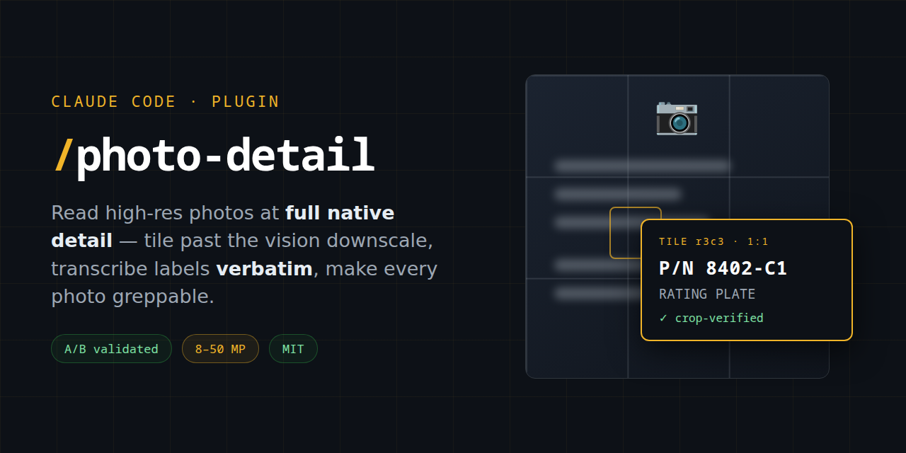

# photo-detail




Claude Code skills for reading high-resolution photos at **full native detail**
— label text, stamped part numbers, model plates, small components — instead of
the ~1.15 MP downscale Claude's vision pipeline normally applies.

Built for documentation projects — maintenance records, equipment inventories,
build logs — where photos carry data you'll want to grep later.

## The problem

Claude downscales every image it reads to roughly 1.15 megapixels. A 50 MP
phone photo of an equipment label arrives as a smudge — and the failure mode is
worse than "can't read it": the model will sometimes **hallucinate a plausible
part number** from the smudge, and it **can't tell the photo is blurry**
because downscaling hides motion blur.

Why not classic OCR? Equipment photos defeat it: stamped and cast-in marks,
oblique angles, grime, curved hose print, mixed fonts. A vision model reading
full-resolution tiles handles all of that *and* describes what the text is
attached to — but only if the pixels survive the trip.

## The skills

### `/photo-detail:inspect-photo` — one photo, full detail

Splits a photo into overlapping tiles small enough to escape downscaling, or
crops one region by frame fractions when you know where to look. Read the
pieces, extract the finding, delete the pieces.

```
/photo-detail:inspect-photo content/photos/2026-05-14-boiler-nameplate.jpg
```

### `/photo-detail:describe-photos` — batch sidecar descriptions

Fans out one worker subagent per photo (Sonnet — bounded, cheap). Each worker
tiles its photo, transcribes **all legible text verbatim**, catalogs visible
components with frame positions, notes condition issues, and writes a sidecar
`<photo-name>.md` next to the photo. The main session then verifies flagged
uncertainties with targeted crops.

Pay the vision cost once; afterwards photo contents are greppable — "which
photo shows the serial number?" becomes a text search, not an image re-read.

```
/photo-detail:describe-photos content/attachments/photos/
```

A sidecar looks like this (abridged):

```markdown
---
photo: 2026-05-14-water-heater-nameplate.jpg
date: 2026-05-14
subject: Water heater rating plate and gas valve area
quality: soft
---

## Transcribed Text
**Rating plate** (upper-center, read via tight crops):
- "Model No. GS6-50-YBRT" / "Capacity 50 GAL / 189 L"
- "Input 40,000 BTU/HR" / "ANSI Z21.10.1"
- Barcode label: "P/N 100210 REV C", date code "0423"

## Uncertain IDs
- Brass fitting with stamped hex mark, lower-right of gas valve
  (function unconfirmed)

## Open Questions
- Straight-on shot of the gas valve dial to read the setting
```

## Validation (A/B tested)

Both methods ran on the same 18 photos — 50 MP close-ups of equipment labels,
wiring, and plumbing in a cramped, dimly lit machinery space — with the same
worker model and output template; only the vision method differed (single
downscaled Read vs. tiled analysis). Disagreements were adjudicated with
independent full-resolution crops.

| | Single Read (baseline) | Tiled (this plugin) |
|---|---|---|
| Materially better descriptions | 0 / 18 | ~10 / 18 (rest tied) |
| Read a full manufacturer data plate | ❌ vendor's city, nothing else | ✅ model, capacity, material, test pressure, date code — verified against the real plate |
| Small component label | ❌ hallucinated a plausible-looking part number | ✅ exact part number + function text, crop-verified character for character |
| Detected blurry sources | ❌ rated 15/18 "sharp" | ✅ graded honestly, produced reshoot list |
| Tokens per 50 MP photo | ~44k | ~112k (2.5×) |

The 2.5× cost buys transcriptions you can actually trust. Tiling is not
infallible — it once confidently misread a stylized script logo — which is why
the skill has the orchestrator re-verify load-bearing strings with its own
crops before they reach your docs.

## Install

```
/plugin marketplace add dgahagan/photo-detail
/plugin install photo-detail@photo-detail
```

### Team auto-install

Commit this to a shared project's `.claude/settings.json` and everyone working
in that repo gets the skills automatically:

```json
{
  "extraKnownMarketplaces": {
    "photo-detail": {
      "source": { "source": "github", "repo": "dgahagan/photo-detail" }
    }
  },
  "enabledPlugins": {
    "photo-detail@photo-detail": true
  }
}
```

### Project conventions (optional, recommended)

The skills work with zero configuration, but a short block in your project's
`CLAUDE.md` makes batch runs fully automatic:

```markdown
## Working with Photos
Photos live in `content/attachments/photos/`, named
`YYYY-MM-DD-<subject>-<description>.jpg`, each with a sidecar `<name>.md`
(generated by /photo-detail:describe-photos). Grep the sidecar before
re-reading the image.
```

## Requirements

- Python 3 with **Pillow** (`pip install Pillow`) — the only dependency of the
  bundled `split-photo.py`
- No network access; everything runs locally

## How it works

`split-photo.py` emits JPEG pieces with a long edge under ~1568 px (the
no-downscale threshold), printing a grid map with pixel spans so tiles can be
read selectively. It also works standalone:

```bash
# overlapping tile grid (survey mode)
python3 split-photo.py photo.jpg

# zoom one region — left,top,right,bottom as 0–1 fractions of the frame
python3 split-photo.py photo.jpg --crop 0.4,0.2,0.8,0.6

# knobs: tile span in px before overlap, overlap fraction, output dir
python3 split-photo.py photo.jpg --target 1200 --overlap 0.15 --out /tmp/tiles
```

For very large sources (≥ ~20 MP) the skills use a two-pass strategy: a coarse
survey grid at `--target 3000`, then full-resolution crops only on
information-dense regions.

Tiles are throwaway working files — the skills reference the original photo in
documentation and delete the pieces when done. Tiling recovers **resolution,
not focus**: a motion-blurred source stays blurry, and the skills are
instructed to say so rather than guess.

## Contributing

Issues and PRs welcome — especially reports from other photo domains
(electronics, appliances, vehicles) where the worker prompts could read better.

## License

MIT
